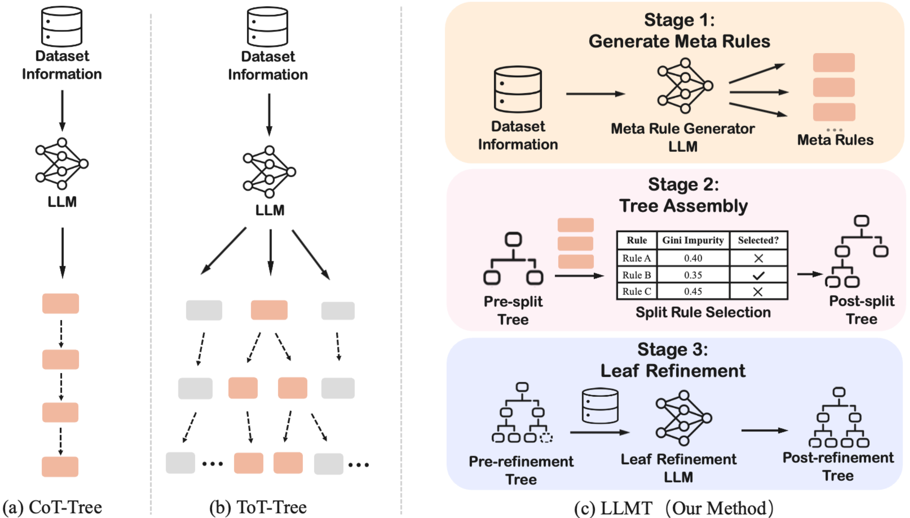

# From Prompts to Trees: Effective LLM-Guided Tree Generation for Few-Shot Tabular Classification

This repository contains the official implementation of our EMNLP 2026 paper, **From Prompts to Trees: Effective LLM-Guided Tree Generation for Few-Shot Tabular Classification**.



# Paper Link

To be updated

# Data Preparation

Extract the datasets, metadata, and precomputed partitions from the repository root:

```bash
tar -xzf dataset.tar.gz
```

# Environment Setup

```bash
conda env create -f environment.yml
conda activate prompt-tree
export OPENAI_API_KEY="your-api-key"
```

# Running Experiments

The examples below show the main experiment settings. 

## LLMT

```bash
python train.py \
  --config config/train/chatgpt-diabetes.yml \
  --strategy single \
  --train-sizes 2 4 8 16 32 \
  --num-tests-per-set 10 \
  --max-depth 3
```

## LLMT Forest

```bash
python train.py \
  --config config/train/chatgpt-diabetes-multiple.yml \
  --strategy llmt_forest \
  --train-sizes 4 \
  --num-tests-per-set 10 \
  --num-trees 10 \
  --max-depth 3
```

## Key Arguments


| Argument                     | Description                                |
| ---------------------------- | ------------------------------------------ |
| `--config`                   | YAML configuration path.                   |
| `--strategy`                 | `single` or `llmt_forest`.                 |
| `--train-sizes`              | Total samples: classes × shots per class.  |
| `--num-tests-per-set`        | Runs per training size.                    |
| `--max-depth`                | Maximum tree depth.                        |
| `--tau`                      | Leaf-refinement threshold (default: 0.70). |
| `--num-trees`                | Trees per forest.                          |
| `--tree-parallelism`         | Concurrent tree builders                   |
| `--random-seed`              | Partition and sampling seed.               |
| `--parallel-batch-size`      | API parallelism limit.                     |
| `--request-interval`         | Request interval (seconds).                |
| `--timeout`                  | Request timeout (seconds).                 |
| `--exp-name`, `--output-dir` | Experiment name and output directory.      |


# Cite

To be updated
